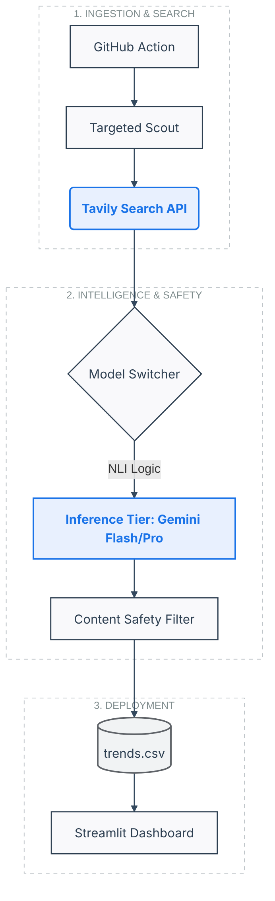

# 🛰️ TrendLab: Autonomous Intelligence Engine
> **A high-signal, zero-maintenance NLI pipeline for tracking technical breakthroughs across configurable domains with enterprise-grade safety gates.**

## 📖 Overview
TrendLab is an automated intelligence asset designed to solve the "Noise-to-Signal" problem in rapidly evolving tech sectors. It scouts high-value domains (ArXiv, GitHub, Reddit), analyzes data via Natural Language Inference (NLI), and presents objective intelligence scores—all while maintaining a strict governance layer to ensure content professionality and corporate compliance.

---

## 🏗️ System Architecture
The pipeline is architected for **high availability and zero operational cost**, utilizing a version-controlled flat-file system for data persistence.

### 🛠️ Key Technical Features

The engine includes a modular **Safety & Redaction Layer** to ensure all generated intelligence is professional and compliant:

* **Entity Masking:** Automatic redaction of specific corporate entities (e.g., Big Four firms) to maintain professional neutrality.
* **Linguistic "Cringe" Filter:** A custom mapping system that identifies and replaces AI-typical buzzwords (e.g., *delve*, *unleash*, *tapestry*) with precise, professional terminology.
* **Toxicity Guard:** Integrated keyword filtering based on standard open-source safety lists to prevent non-professional content ingestion.

To ensure 100% uptime within free-tier quotas, the system features a **Hierarchical Fallback Mechanism**. The **Model Switcher** logic detects rate limits (429) or unavailability and automatically shifts the inference load across a configured priority list:

1.  **Primary:** `gemini-3-flash-preview`
2.  **Secondary:** `gemini-2.5-flash` / `gemini-2.5-pro`
3.  **Legacy:** `gemini-pro-latest`

The system is entirely **domain-agnostic**. By modifying the `config.json`, the scout can pivot across diverse technical vectors:

* **AI & LLM Frontier:** Tracking agentic workflows and fine-tuning breakthroughs.
* **The AI Bubble (Infra):** Monitoring GPU compute costs and infrastructure valuation.
* **Cybersecurity:** Scanning for 0-day exploits, PoC releases, and threat actors.
* **Consumer Tech:** Tracking the evolution of wearables and handheld AI hardware.
* **FinTech & Web3:** Analyzing L2 scaling, stablecoins, and CBDC compliance.

---

### 👤 About the Author

I am a professional at a **Big Four professional services firm**, specializing in the intersection of **Software Engineering, AI Orchestration, and Technical Risk Management.**

**Let's Connect:** 

> *This project is architected with a **"Security-First"** mindset, ensuring that AI-driven insights remain professional, accurate, and objective.*